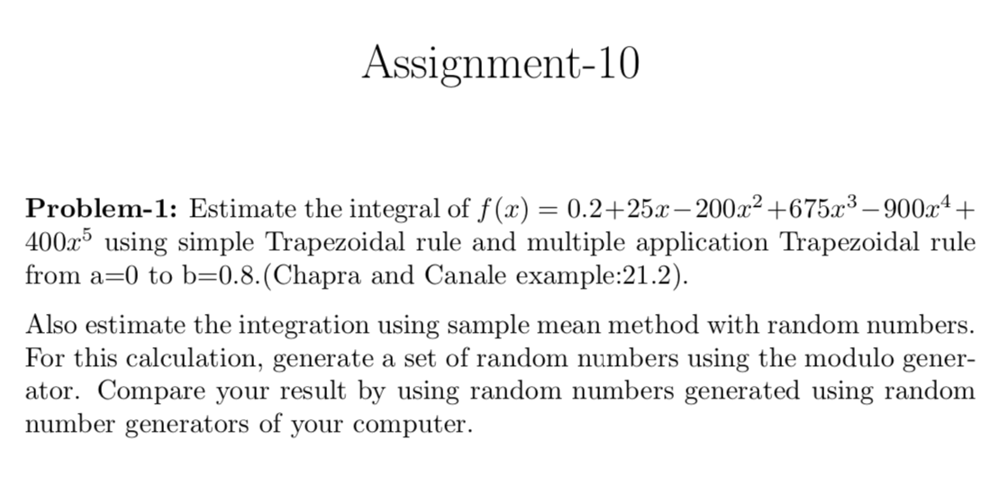
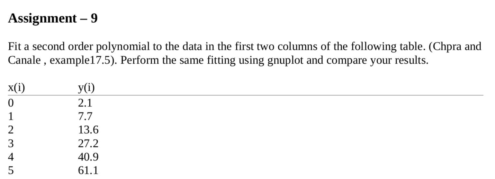
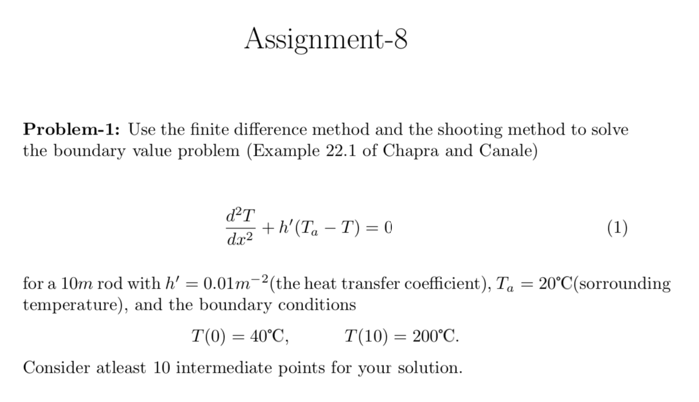
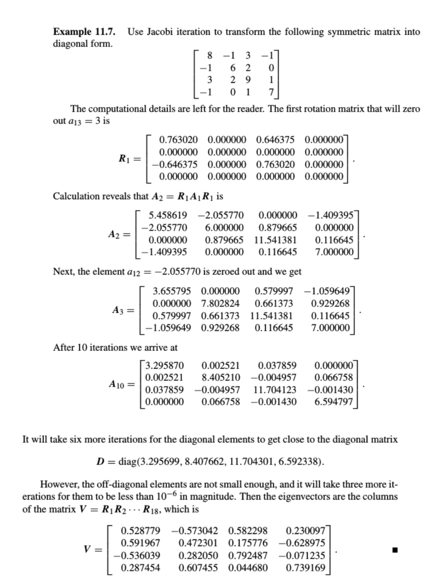
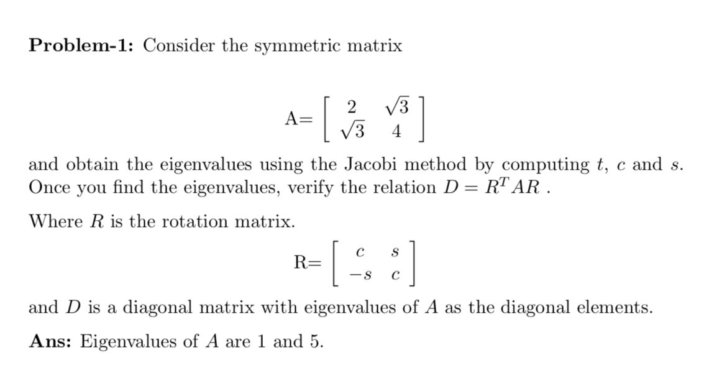
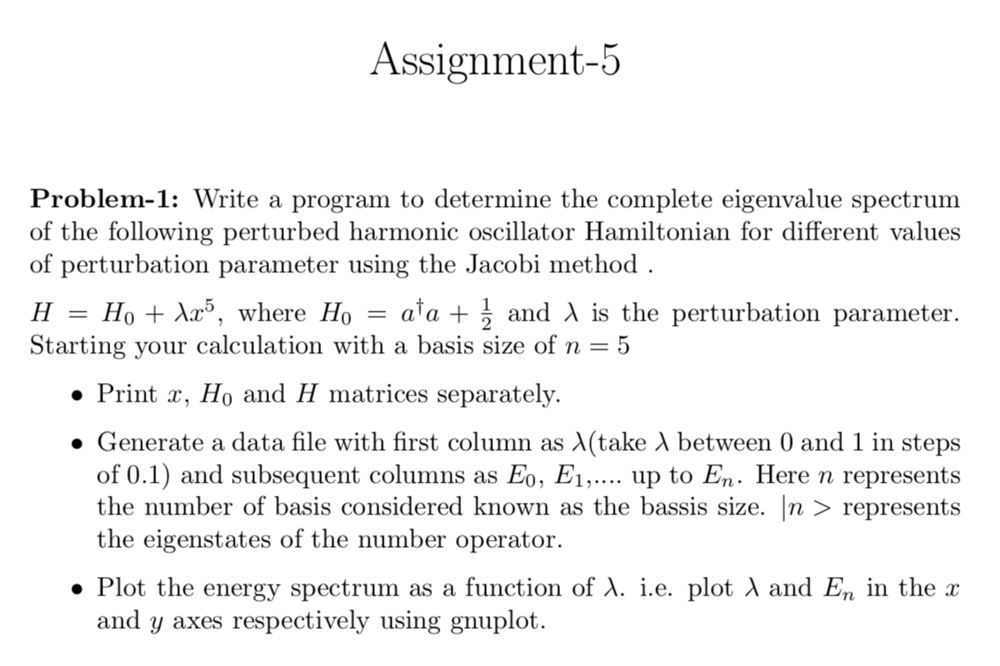
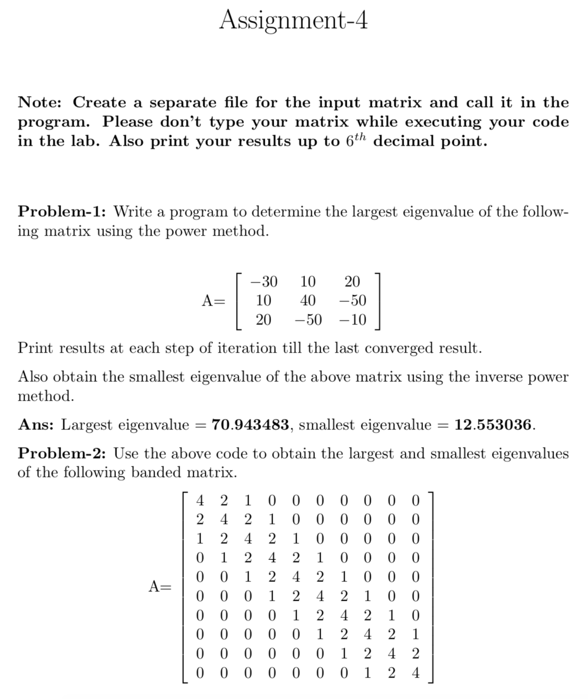
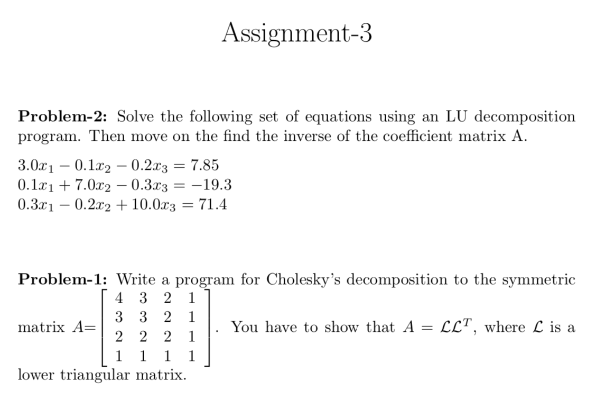
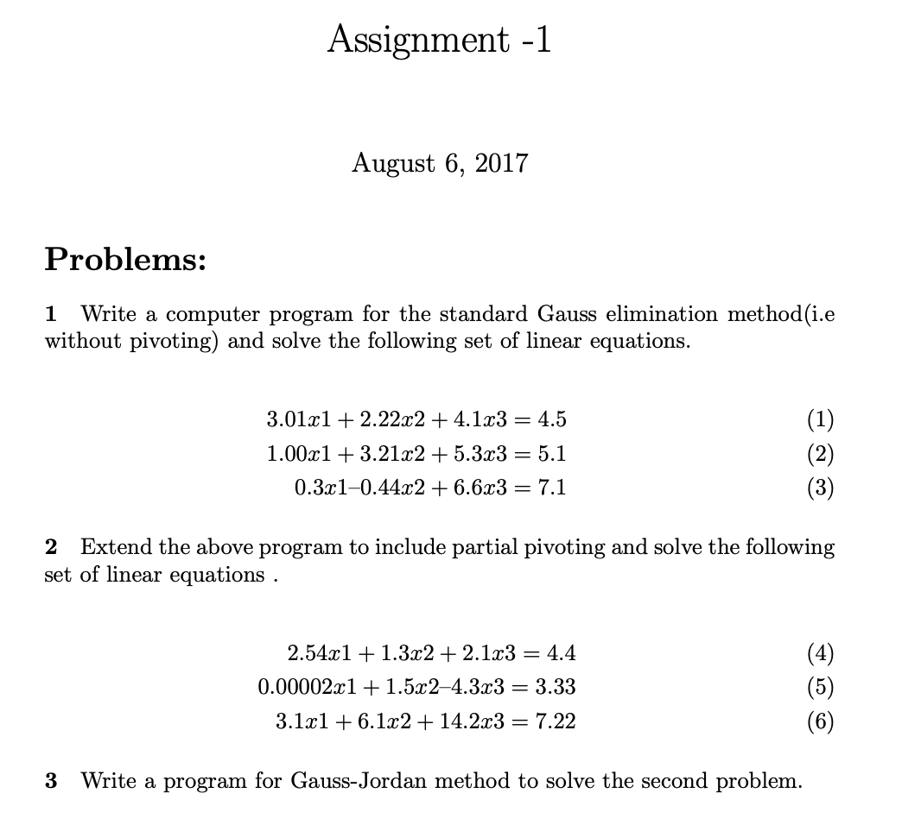

# computational_physics
This repository contains the codes for the course on Computational Physics: PH305. This course involved Computer Science, Applied Mathematics and Physics knowledge to solve various complex problems in Physics

### Assignment 10
 <!-- .element height="50%" width="50%" -->
### Assignment 9

### Assignment 8

### Assignment 7

### Assignment 6

### Assignment 5

### Assignment 4

### Assignment 3

### Assignment 2

### Assignment 1

